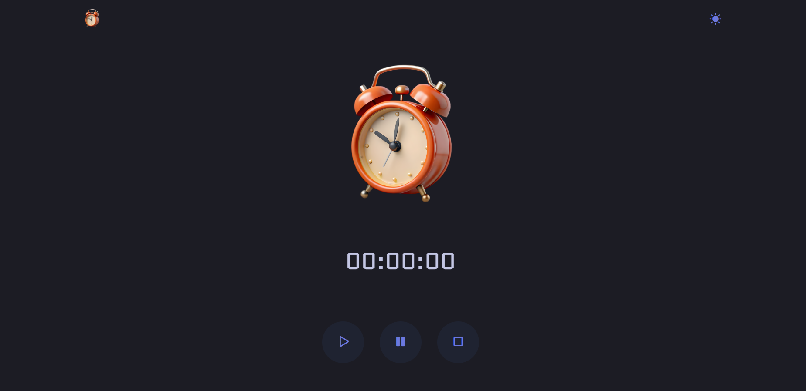
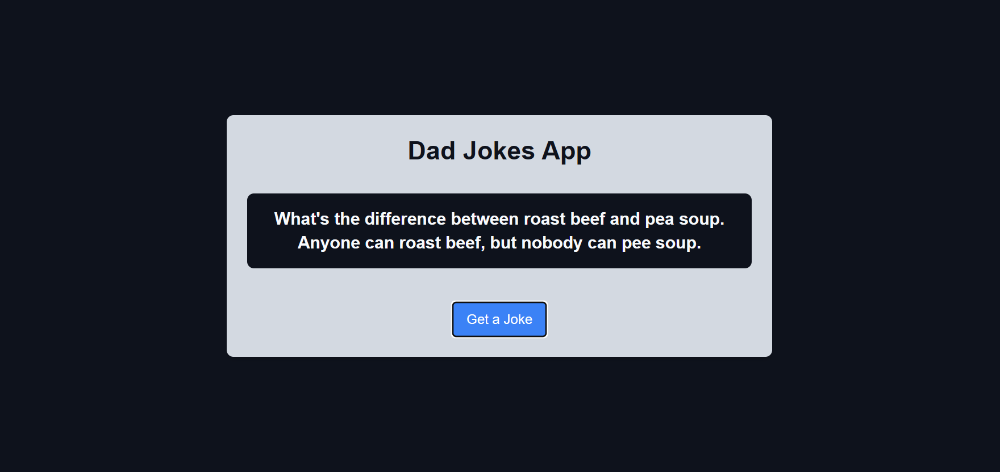

# 🕹️ JS Project Lab

A curated collection of Vanilla JavaScript mini-projects focused on DOM manipulation, browser APIs, and responsive UI patterns.


🔗 **Live Demo:** [javascript-arcade-gold.vercel.app](https://js-arcade-five.vercel.app/)

---

## 📁 Repository Overview

This workspace includes:

- A Vite-powered landing page (`index.html`, `main.js`, `style.css`)
- Individual project apps inside `projects/`
- Shared assets and screenshots inside `assets/`

Current project folders:

- `projects/calculator`
- `projects/clock-timer`
- `projects/dad-jokes`
- `projects/counter` *(currently empty / WIP)*

---

## 🚀 Projects + Screenshots

### 1) 🧮 Calculator

Path: `projects/calculator`

Features:
- Dynamic button rendering from a JS configuration array
- Keyboard shortcuts for calculator input
- Scientific operations (trig, log, factorial, reciprocal, exponent)
- Expression/result history panel


---

### 2) ⏱️ Clock Timer

Path: `projects/clock-timer`

Features:
- Start, pause, and reset controls
- `HH:MM:SS` time formatting
- Light/dark mode toggle using CSS custom properties



---

### 3) 😂 Dad Jokes App

Path: `projects/dad-jokes`

Features:
- Async joke fetch from `https://icanhazdadjoke.com/`
- Loading state + error fallback text
- Minimal, centered card UI



---

## 🧰 Tech Stack

- HTML5
- CSS3 + CSS Variables
- Vanilla JavaScript (ES6+)
- Tailwind CSS (via `@tailwindcss/vite`)
- Vite (multi-page build config)

---

## ▶️ Run Locally

1. Install dependencies:

   `npm install`

2. Start development server:

   `npm run dev`

3. Build production output:

   `npm run build`

4. Preview production build:

   `npm run preview`

### Clone the repository:
   ```bash
   git clone https://github.com/khalilkhancodes/js-arcade.git